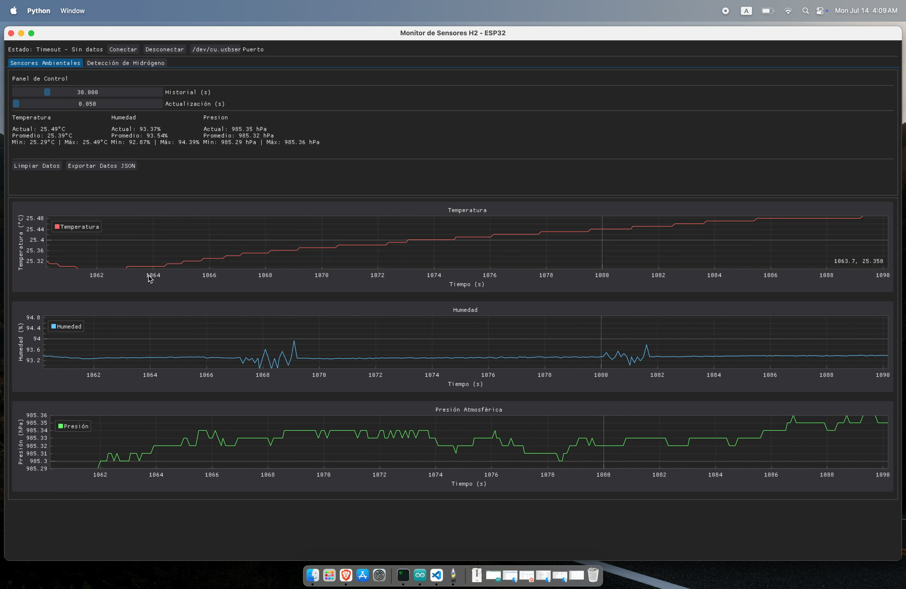
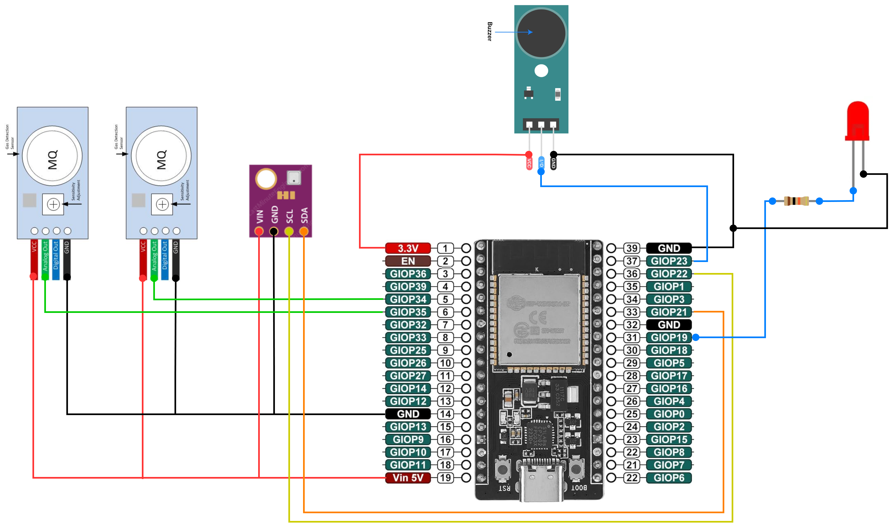
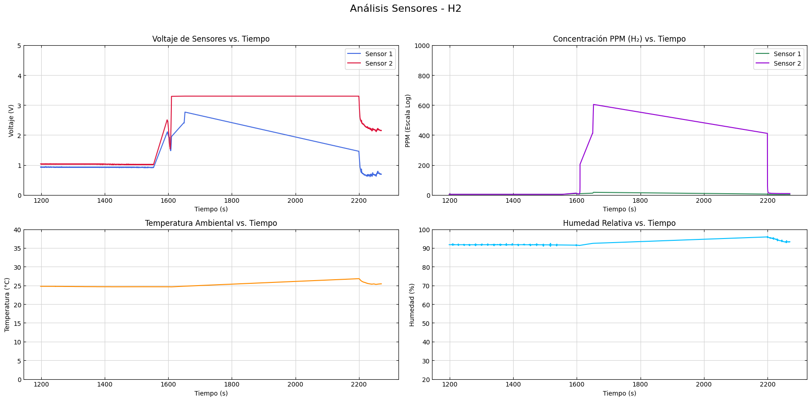

# ESP32 Hydrogen Detector

[Hydrogen detection demonstration](assets/video/h2-test-detection.gif)

Low-cost real-time hydrogen gas (H₂) monitoring system built with an ESP32-WROVER, two MQ-8 gas sensors, and a BME280 environmental sensor. The ESP32 runs as a WiFi Access Point with a WebSocket server, streaming sensor data to a Python desktop client for live visualization, alarm control, and data logging.



## How It Works



The ESP32 creates a local WiFi network (AP mode) and runs a WebSocket server on port 81. It reads both MQ-8 sensors (averaging 10 samples per reading to reduce noise) and the BME280 via I²C, packages everything as JSON, and streams it to the connected client at 10 Hz. The client renders live time-series plots and bar charts, computes estimated H₂ concentration in PPM using the sensor's logarithmic curve, and can activate or deactivate the buzzer alarm remotely.

The system implements three alarm levels based on ADC thresholds, with the buzzer producing beeps at different rates depending on severity. The buzzer can also be overridden manually from the client.

### PPM Estimation



The MQ-8 output voltage is converted to an estimated H₂ concentration using the standard MOS sensor model: the sensor resistance (Rs) is derived from the voltage divider with the load resistor (RL = 10 kΩ), normalized against the clean-air baseline resistance (R₀), and mapped to PPM through the logarithmic characteristic curve. The R₀ values were calibrated by averaging readings in clean air after a 4-hour preheat period. These PPM values should be interpreted as qualitative indicators rather than precise measurements, given the inherent non-linearity of both the MQ-8 sensor and the ESP32 ADC.

## Project Structure

```
├── firmware/
│   └── sketch_h2_gas_detector_websocket/
│       └── sketch_h2_gas_detector_websocket.ino
│
├── monitor/
│   ├── monitor.py                  # DearPyGui desktop client
│   ├── console_client.py           # Terminal-based WebSocket client
│   └── config.json                 # Monitor configuration
│
├── analysis/
│   ├── sensor_analysis.ipynb       # Post-experiment data analysis
│   ├── sensor_data_air.json        # Baseline readings (clean air)
│   ├── sensor_data_alcohol.json    # Cross-sensitivity test (alcohol)
│   └── sensor_data_h2.json         # Hydrogen exposure test
│
├── assets/
│   └── images/                     # Circuit diagrams and prototype photos
│
└── README.md
```

## Hardware

| Component            | Model                | Function                                         |
| -------------------- | -------------------- | ------------------------------------------------ |
| Microcontroller      | ESP32-WROVER         | WiFi AP + WebSocket server + ADC readings        |
| Gas sensor (×2)      | MQ-8                 | Hydrogen detection (MOS, SnO₂-based)             |
| Environmental sensor | BME280               | Temperature, humidity, barometric pressure (I²C) |
| Buzzer               | Active buzzer module | Audible alarm                                    |
| LED                  | 5mm LED              | Connection status indicator                      |

### Circuit

The MQ-8 sensors connect to GPIO 34 and 35 (ADC inputs). The BME280 communicates via I²C (default address 0x76). The buzzer is on GPIO 23 and the status LED on GPIO 19.

## WiFi Access Point

| Setting   | Value                 |
| --------- | --------------------- |
| SSID      | `ESP32_H2_Monitor`    |
| Password  | `H2Monitor2024`       |
| IP        | `192.168.4.1`         |
| WebSocket | `ws://192.168.4.1:81` |

## Firmware Setup

### Requirements

- [Arduino IDE](https://www.arduino.cc/en/software)
- ESP32 board support package
- Libraries: `WiFi`, `WebSocketsServer`, `ArduinoJson`, `Adafruit_BME280`, `Adafruit_Sensor`

### Upload

1. Open `firmware/sketch_h2_gas_detector_websocket/sketch_h2_gas_detector_websocket.ino`
2. Select board **ESP32 Wrover Module**
3. Upload via USB

## Monitor Client

### Requirements

```
dearpygui
websocket-client
rel
```

Install:

```bash
pip install dearpygui websocket-client rel
```

### Desktop client (GUI)

```bash
cd monitor
python monitor.py
```

Connect to the ESP32 WiFi network first, then click **Connect** in the GUI. The interface has three tabs: environmental sensors (temperature, humidity, pressure plots), hydrogen detection (ADC values, voltage, PPM bar charts and time series), and advanced controls (sensor calibration, alarm thresholds).

### Console client

```bash
python console_client.py
```

Text-based client with an interactive menu for sending commands (buzzer on/off/auto, status request) and viewing live sensor readings in the terminal.

## Calibration Parameters

| Parameter           | Sensor 1 | Sensor 2 |
| ------------------- | -------- | -------- |
| R₀ (clean air)      | 60.21 kΩ | 53.46 kΩ |
| RL (load resistor)  | 10 kΩ    | 10 kΩ    |
| Curve slope (m)     | -1.8     | -1.8     |
| Curve intercept (b) | 0.76     | 0.76     |

## WebSocket Protocol

The ESP32 sends JSON messages of different types:

**Sensor data** (10 Hz):

```json
{
  "type": "sensor_data",
  "packet_id": 42,
  "mq8_1": { "raw": 1024, "voltage": 0.825 },
  "mq8_2": { "raw": 980, "voltage": 0.790 },
  "bme280": { "temperature": 28.5, "pressure": 1013.2, "humidity": 65.3 },
  "alarm_level": 0
}
```

**Commands** (client → ESP32):

```json
{ "command": "BUZZER_ON" }
{ "command": "BUZZER_OFF" }
{ "command": "BUZZER_AUTO" }
{ "command": "STATUS" }
{ "command": "RESET" }
```

---


*Originally developed on 14 July 2025.*
